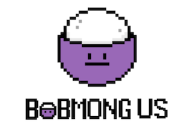
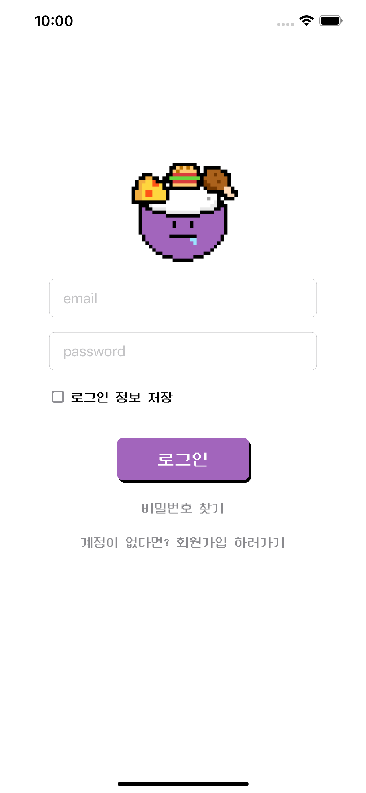
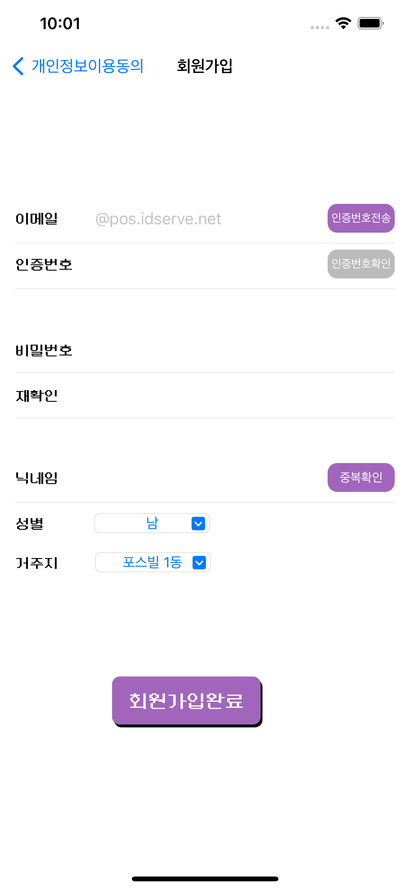
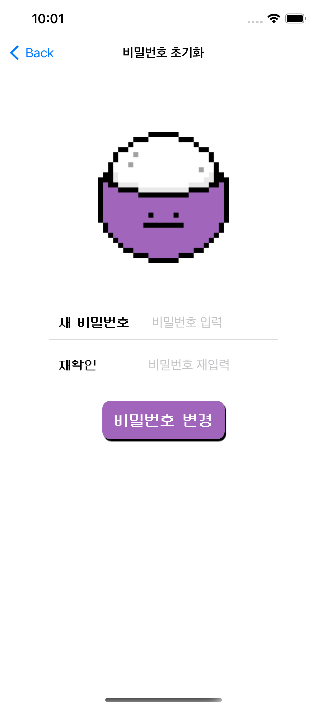
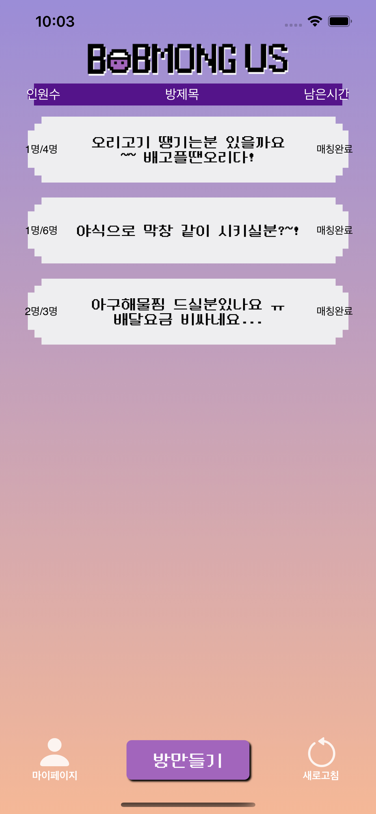
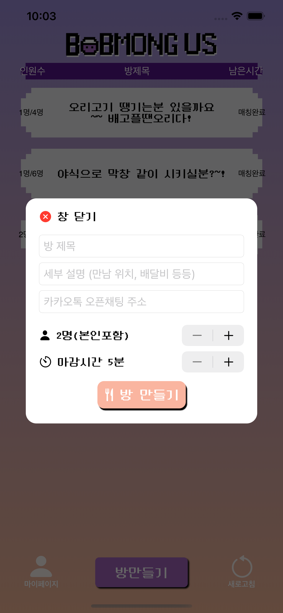
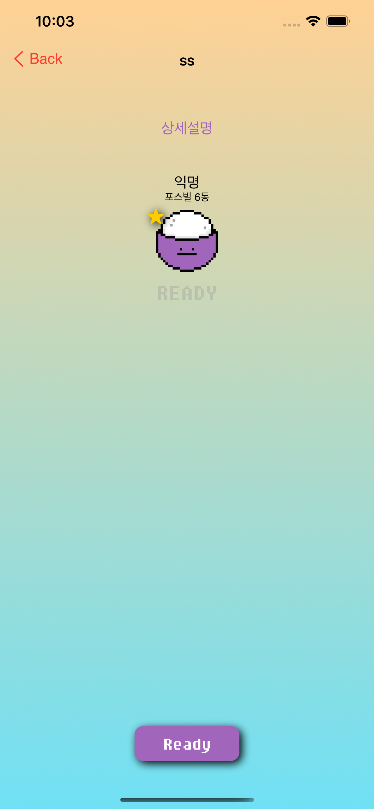
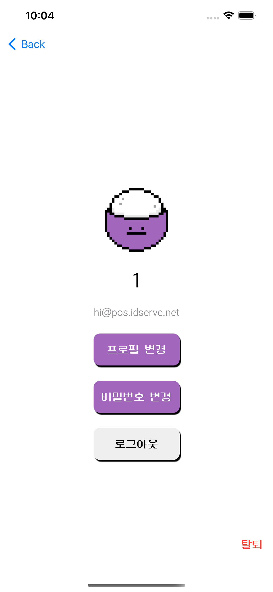
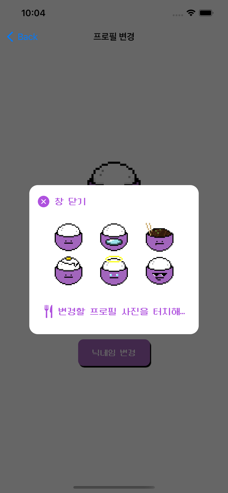
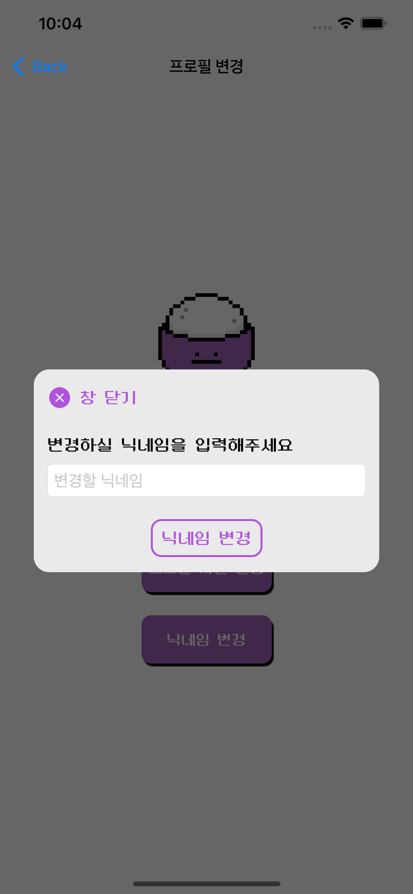

# 밥몽어스 (Bobmongus)

**배달 요금, 최소 주문 금액이 너무 커서 배달시킬때마다 고민이라면?**

> 배고픈 애플 아카데미 러너들을 위한 배달 매칭 서비스.
>
> 배달 시켜 먹고 싶은 메뉴가 있다면 직접 방을 만들어 보세요.
>
> 다른 사람들과 함께 배달 시켜보세요.

 

## 📋Stack

1. 이슈관리 : Miro
2. 형상관리 : Github
3. 커뮤니케이션 : Ryver, Notion, Zoom
4. 개발 환경
   - OS : MacOS (M1Pro)
   - IDE : Xcode 13.3
5. 상세 사용
   - Application : SwiftUI
   - Design : Sketch

 

## 🔨Features

- 방 리스트에서 다른 방 입장. 레디 및 스타트 구현.
- 새로운 방 생성.
- 로그인/회원가입.  유저관리 (비밀번호 찾기, 프로필 사진 변경)

 

## 🌈Usage

| login                                                        | sign in                                                      | reset password                                               |
| ------------------------------------------------------------ | ------------------------------------------------------------ | ------------------------------------------------------------ |
|  |  |  |

| Main                                                         | Room Create                                                  | Room detail                                                  |
| ------------------------------------------------------------ | ------------------------------------------------------------ | ------------------------------------------------------------ |
|  |  |  |

| Mypage                                                       | Mypage-1                                                     | Mypage-2                                                     |
| ------------------------------------------------------------ | ------------------------------------------------------------ | ------------------------------------------------------------ |
|  |  |  |

 

## 💬Contact

| 이름                                                         | 역할                                 |
| ------------------------------------------------------------ | ------------------------------------ |
| [김현수](https://github.com/BrightHyeon) - swiftist9891@gmail.com | 방 내부 로직 작성. 전체 코드 디버깅. |
| [박강욱](https://github.com/rkddnr330) - rkddnr330@gmail.com | 마이페이지 기능 구현.                |
| [전윤준](https://github.com/ChickenJoah) - kpl88@naver.com   | 로그인, 회원가입 로직 작성.          |
| [백서현](https://github.com/100seo) - deepgreen7362@gmail.com | 방 생성 기능 구현. 디자인 총괄.      |
| [장성훈](https://github.com/jsh9611) - jangsh9611@gmail.com  | 메인페이지 구현.                     |
| [류현선](https://github.com/hs-ryu) - richman20486@gmail.com | 비밀번호 초기화 로직 작성.           |

